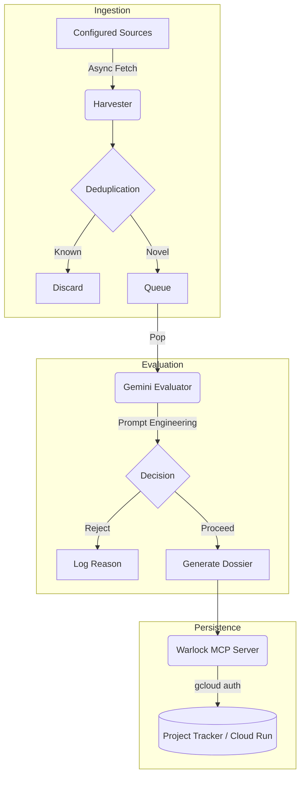

# 🐙 Eldritch Harvester

An autonomous, agentic data ingestion and evaluation pipeline built on **Python**, **Google Gemini**, and the **Model Context Protocol (MCP)**.

This repository is the data-gathering engine of the Works-by-Worrell engineering platform. It actively monitors configured targets, deduplicates previously seen entries, and uses LLMs to score novel results against a strict, private operator profile.

---

## 🏗️ Architecture

The pipeline is designed as a sequence of idempotent, asynchronous layers:



### Core Components
1. **The Harvester**: A configurable scraping engine that pulls data from target boards and normalizes the payload.
2. **The Hopper**: A deduplication layer backed by local file state (`processed_links.txt`) that ensures the LLM is only invoked on novel data.
3. **The Evaluator**: An agentic loop calling the Google Gemini API. It scores the candidate data against a highly specific operator profile to return a binary `PROCEED / REJECT` decision.
4. **Warlock MCP Integration**: If an evaluation passes, the system issues a remote procedure call to the Warlock MCP server (hosted on GCP Cloud Run) to persist the lead in a secure project tracker.

---

## 🛠️ Tech Stack
- **Runtime**: Python 3.12+ (managed via `uv`)
- **Concurrency**: `asyncio` for parallel ingestion
- **AI/LLM**: Google Gemini API
- **Persistence Layer**: Model Context Protocol (MCP) interacting with Google Cloud Run

---

## 🚀 Local Execution

This project uses `uv` for lightning-fast dependency management and virtual environment execution.

### Prerequisites
- Install `uv`: `curl -LsSf https://astral.sh/uv/install.sh | sh`
- Set your Google Gemini API key in the `.env` file: `GEMINI_API_KEY=your_key_here`

### Running the Pipeline
Execute the main entrypoint directly using `uv run`. This ensures the virtual environment and dependencies are automatically synced:

```bash
uv run main.py
```

### Configuration
- `search_terms.txt`: Keywords used by the harvester to filter upstream data.
- `target_boards.txt`: URLs of the data sources.
- `hopper.txt`: Temporary queue of novel links awaiting evaluation.

---

## 🤝 Contribution Guidelines
Please refer to [CONTRIBUTING.md](CONTRIBUTING.md) for strict branch taxonomy and Conventional Commit requirements before opening a PR.
